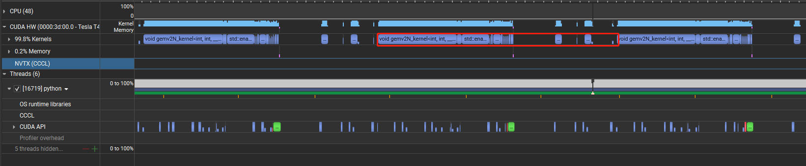
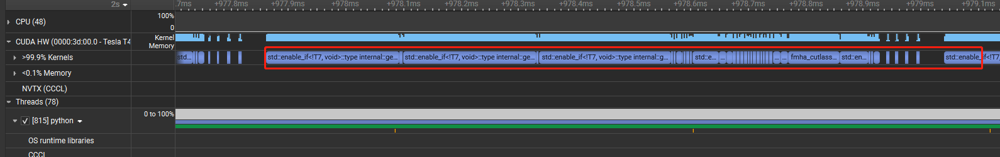

# 1.功能

1. **性能加速**  
   - 在Qwen2模型上实现**4倍加速比**（vs 原生Transformer）
   - 支持**Continuous Batching**，显著提高吞吐量

2. **注意力优化**  
   - 集成`FlashAttention-1/2`与`FlashDecoding`算子
   - 支持**NoPad Attention**机制，减少无效计算
   - 实现**PageAttention**内存管理

3. **内存优化**  
   - **Radix Caching** KV缓存策略
   - 动态**Tensor Parallelism**支持（2D/3D并行）

4. **算子融合**  
   - 定制化实现：
     - `RMSNorm`层优化
     - `ROPE`位置编码加速
     - `SiLU_and_Mul`激活融合


# 2.项目依赖

以下是nvcc,pytorch,triton的版本

```
# root@5d2906ec57d4:~/LiteLang/test# nvcc -V
nvcc: NVIDIA (R) Cuda compiler driver
Copyright (c) 2005-2022 NVIDIA Corporation
Built on Wed_Sep_21_10:33:58_PDT_2022
Cuda compilation tools, release 11.8, V11.8.89
Build cuda_11.8.r11.8/compiler.31833905_0
# root@5d2906ec57d4:~/LiteLang/test# pip list | grep -E "torch|triton"
torch                                  2.7.0
triton                                 2.2.0

```

# 3.快速使用

## 3.1 权重下载

推荐下载[Qwen2-1.5B](https://huggingface.co/Qwen/Qwen2-1.5B/tree/main)语言模型权重，保存到/root/LiteLang/models/Qwen2-1.5B/

## 3.2 安装litelang
使用一下命令直接安装lite_lang
```
apt-get install git
pip install --user git+https://github.com/ppppppppig/lite_lang.git
```
或者，获取代码库，再安装
```
git clone git@github.com:ppppppppig/lite_lang.git
cd lite_lang
pip install -e .
```


## 3.3 快速启动
```
CUDA_VISIBLE_DEVICES litelang --model_path /root/LiteLang/models/Qwen2-1.5B/
```
以下是详细参数

```
#root@5d2906ec57d4:~/LiteLang# litelang --help 
Usage: litelang [OPTIONS]

Options:
  --model_path TEXT            权重路径
  --max_output_length INTEGER  最大输出长度
  --max_input_length INTEGER   最大输入长度
  --max_batch_size INTEGER     最大batchsize
  --tp INTEGER                 tp并行数
  --port INTEGER               监听端口
  --mem_usage FLOAT            显存使用率
  --max_reqs FLOAT             就绪队列最大请求数
  --busy_scale FLOAT           系统不繁忙时减小请求的最大生成长度，尝试调度更多请求去推理
  --use_radix_cache BOOLEAN    是否使用radix缓存
  --help                       Show this message and exit.
```

# 4.当前性能（v0.8）

## 4.1 使用Qwen2.5-3B的模型进行测试
可以使用一下命令对litelang进行性能测试，在prefill阶段，相比transformers，litelang吞吐提升了约5倍，在decode阶段, litelang吞吐提升约4倍。可以根据以下命令复现结果

prefill 性能如下：
```
root@5d2906ec57d4:~/LiteLang/test# CUDA_VISIBLE_DEVICES=5 python generate_token.py --max_prefill_length 600 --max_new_tokens 1 --max_batch_size 40
litelang decode throughput: 14.68683987110433 tokens/s

root@5d2906ec57d4:~/LiteLang/test# CUDA_VISIBLE_DEVICES=5 python transformers_test.py --max_prefill_length 600 --max_new_tokens 1 --max_batch_size 10
transformers decode throughput: 2.4682934601535673 tokens/s
```
decode 性能如下：
```
CUDA_VISIBLE_DEVICES=5 python generate_token.py --max_prefill_length 600 --max_new_tokens 600 --max_batch_size 40
litelang decode throughput: 864.2122438757503 tokens/s

root@5d2906ec57d4:~/LiteLang/test# CUDA_VISIBLE_DEVICES=5 python transformers_test.py --max_prefill_length 600 --max_new_tokens 600 --max_batch_size 40
transformers decode throughput: 175.69747582720956 tokens/s
```

## 4.2 后续性能优化方向

### 4.2.1 算子与算子之间存在较多的冗余操作

目前单条请求的性能不符合预期，在3B模型上，decode阶段吞吐只有transformers的1.5倍，使用nsight查看单条请求时序图，发现page attn处出现了较大的空隙，这里应该是一个可优化空间。



查看transformers的单条请求时序图, gpu没有太大的空泡




