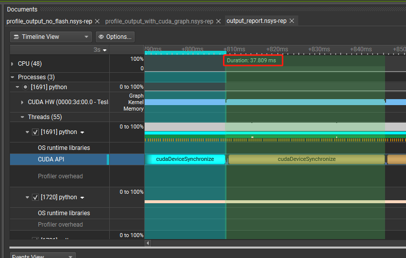

### 1.背景

在推理时，算子主要有两个阶段，kernel launch和kernel compute，他们的运行如下图所示：


可以看到，kernel launch和kernel compute基本上是并行的，一个在cpu上执行，一个在gpu上执行（kernel launch有一部分会在gpu上执行）。当有许多算子的时候，CPU需要深度参与每一个kernel的launch，同时很多时候kernel compute在等待kernel launch的执行。

引入cuda graph就是为了解决上述问题，他有两个较为重要的功能:

1.减少cpu开销，cpu只需要执行一次graph launch

2.减少了大量的kernel launch时间，优化整体的执行速度

同样的，cuda graph中也存在限制，最大的限制是，cuda graph只允许固定的输入输出，在llm的实际应用中，因为prefill阶段变化太多，一般只在decode阶段使用（seq不变，只变batch），这样可以预先定义多组cuda graph，然后推理阶段在选择cuda grap。(每组cuda grap都会占用更多显存，所以一般不会预定义太多的cuda graph，通过padding的方式将batch补过去)

### 2.使用nsight system查看性能数据

#### 2.1 安装nsys cli，获取统计数据
通过以下指令安装nsys
```
wget https://developer.download.nvidia.com/devtools/nsight-systems/NsightSystems-linux-cli-public-2024.4.1.61-3431596.deb
apt update
apt install -y ./NsightSystems-linux-cli-public-2024.4.1.61-3431596.deb
```

运行[示例代码](./cuda_graph.py), 执行
```
nsys profile -o output_report python cuda_graph.py
```

通过nsight system查看，没有使用cuda_graph前，会有多个kernel launch，如下图所示：



使用cuda_graph后，只会有一个graph launch，如下图所示


由于cuda_graph一般在cpu利用率高，系统调度频繁，kernel计算量比较小的场景下有效，所以我们测试的场景中，无法看出cuda_graph的优化，使用cuda_graph前，mha attn推理一次耗时38ms:


使用cuda_graph后，mha attn推理一次耗时约40ms:


这里猜测，如果降低输入张量大小，那么应该能比较明确的看到cuda graph的作用，由于时间的关系，我在这里不做验证

