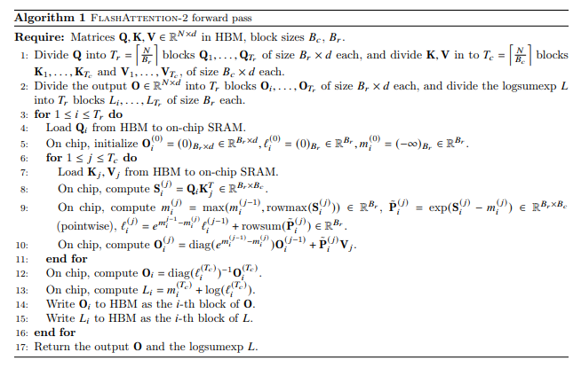
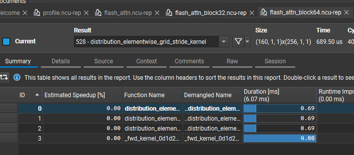
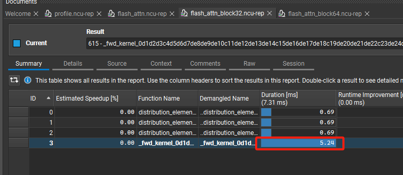

### 1.背景

由于存储分级，高速缓存容量小，IO快，所以应该尽量使用高速缓存。在GPU中，应该尽量使用SRAM存储计算内容。

基于这个思想，出现了flash attn，主要思想就是将数据存到SRAM中，避免直接访问HBM显存。


由于SRAM空间较小，如果需要计算完整张量，空间肯定不够，这限制了我们必须使用局部化技术计算完整张量。


分析attn计算过程，实际上做矩阵乘法时，比较好运用局部性原理，我们加载小q，小k进行计算即可。但主要限制的是softmax，一般必须要求得完整张量后得出，于是flash attn提出了局部softmax。

### 2.局部softmax
目的是需要建立一个公式，通过局部的归一化值得到全局的归一化值。

softmax公式如下：
$$
\text{softmax}(x_i - x_{max}) = \frac{e^{x_i - x_{max}}}{\sum_{j=1}^{N} e^{x_j - x_{max}}}
$$
减去$x_{max}$是担心指数爆炸
设前N个元素的分母为：
$$
l_{pre}: \sum_{j=1}^{N} e^{x_j - x_{pre}} 
$$
前N个元素最大值为：$m_{pre}$, 前N+1个元素最大值为:$m_{cur}$,分母为：
$$
l_{cur} = \sum_{j=1}^{N+1} e^{x_j - x_{last\_max}} = l_{pre} +  e^{x_{N+1} - x_{cur}}
$$
可知，前N个元素中，第i个元素$p_i$：
$$
p_i = e^{x_i - m_{pre}} / l_{pre}
$$
当引入第N+1个元素时，$p_i$需要更新为:
$$
p_i = p_i * l_{pre} / l_{cur}
$$
这样就使局部归一化值更新为全局归一化值。

代码在文件[tile_softmax.py](./tile_softmax.py)中

### 3.使用torch实现的类flash attn v2代码

其中局部softmax按照第二节所述，在softmax以外，我们需要将q, k, v三个矩阵分成多个tile(block * block)。对seq_len进行切分，首先循环q_tile，再循环k_tile和v_tile，最终计算出当前当前block的attn_score。

attn v2官方代码如下所述，这个的主要难点在于局部softmax。

本块代码文件在[flash_attn_mock_code.py](./flash_attn_mock_code.py)

### 4.使用triton编写真正的flash attn v2代码

根据之前的思想，使用triton的接口实现起来，直接上代码：[flash_attn_v2](./flash_attn_v2.py)


### 5.性能优化

通过ncu收集算子性能数据, 使用ncu记录数据的时候，最好把输出语句注释掉，否则会记录很多额外的算子，可能是张量太大，输出的时候要从显存copy到主存（我这里记录了100多个==PROF== Profiling "CatArrayBatchedCopy" - 89: 0%....50%....100% - 31 passes）
```
ncu --target-processes all --set full -o flash_attn_test python flash_attn_v2.py
```
我分别收集了BLOCK=16, 31, 64的flash_attn算子性能数据，发现BLOCK的大小对flash_attn算子的性能影响较大, BLOCK=16的推理时间最长，其次是BLOCK32，最优是BLOCK64，当BLOCK=128是，GPU提示SM资源不足。

**BLOCK=64的性能数据**



**BLOCK=32的性能数据**



所以为了使算子有最佳性能，要使BLOCK = math.floor(SM_SHM_SIZE // element_type_size // HEAD_DIM), 因为找不到接口直接获取SM_SHM_SIZE， 于是使用triton.autotune接口，测试哪一种BLOCK大小推理速度更快。
```
configs = [
    triton.Config({'BLOCK_M': BM, 'BLOCK_N': BN}, num_stages=s, num_warps=w) \
    for BM, BN in [(32, 32), (64, 64)]\
    for s in [1, 2, 3]\
    for w in [1, 2, 4, 8]\
]

@triton.autotune( configs, key=["HEAD_DIM"])
```
加了autotune后，发现会对attn_fwd算子收集比预想中多得多的数据，原因是autotune对一个配置会重复执行多次算子，于是收集到的数据就会非常多。